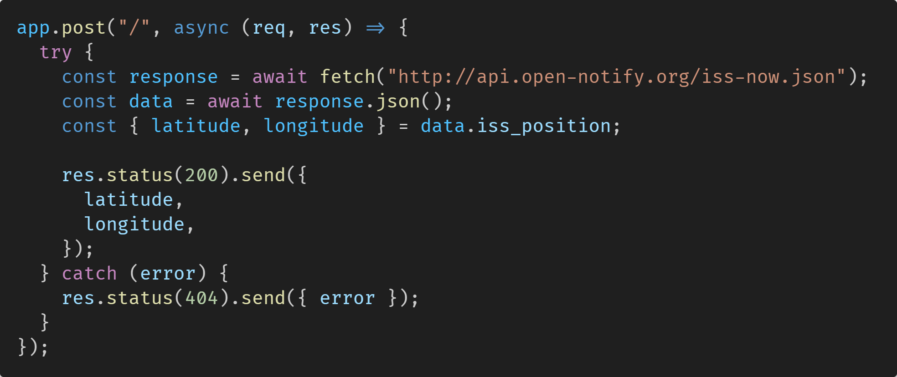
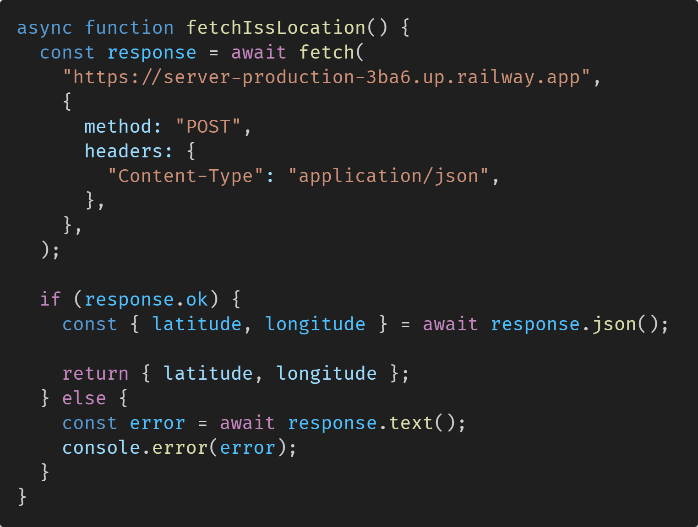
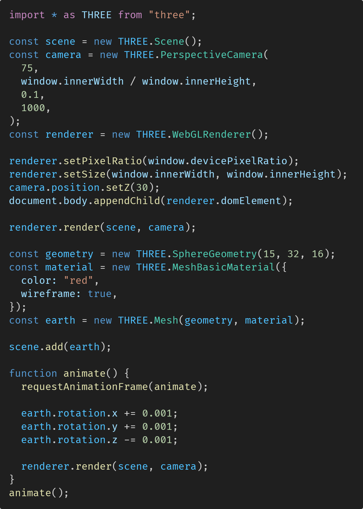
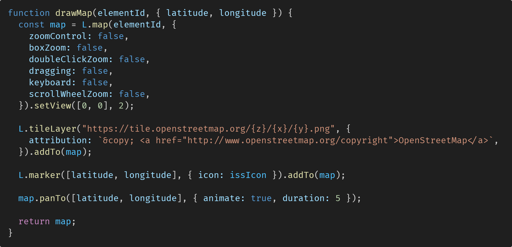

# Where is ISS?
*A simple app that tells you where the International Space Station is.*


## About
**URL:** [https://where-is-iss-production.up.railway.app/](https://where-is-iss-client.onrender.com/) <br>
**Created by:** [Mike Newberry](https://github.com/MikeNewXYZ)

**_This project was created as part of an assignment for a coding course. The bulk of it was made in a few hours. It uses HTML, Tailwind CSS, ThreeJS, LeafletJS, JavaScript, NodeJS and ExpressJS._**

</br>

## 💻 Installing

```console
> git clone https://github.com/MikeNewXYZ/where-is-iss.git
```

### Front-end
```console
> cd client
> npm i
> npm run dev
```

### Back-end
```console
> cd server
> npm i
> npm run start
```

</br>

## How it works!

### 🚀 How did I find out where the ISS is?
[](./server/server.js)
[](./client/src/lib/fetch-iss-location.js)
It fetches the data from the ISS location API, gets the latitude and longitude and sends that off to the front end. I don't use the ISS API directly on the front-end as this would cause a CORS error.

## 🌍 How did I make the 3D globe background?
[](./client/src/lib/render-background.js)
Using ThreeJS I create a scene and camera, and then render a red wireframe sphere on the page. Using the [requestAnimationFrame](https://developer.mozilla.org/en-US/docs/Web/API/Window/requestAnimationFrame) method, which calls its callback every frame tick, I animate the globe rotating.

## 🕺 How do I display the map?
[](./client/src/lib/draw-map.js)
After I've gotten the location of the ISS from the ISS API I input its latitude and longitude into a drawMap function I created. This function uses [LeafletJS](https://leafletjs.com/) with [OpenStreetMap](https://www.openstreetmap.org/) to draw a map on screen and then pan to the location of the ISS.


